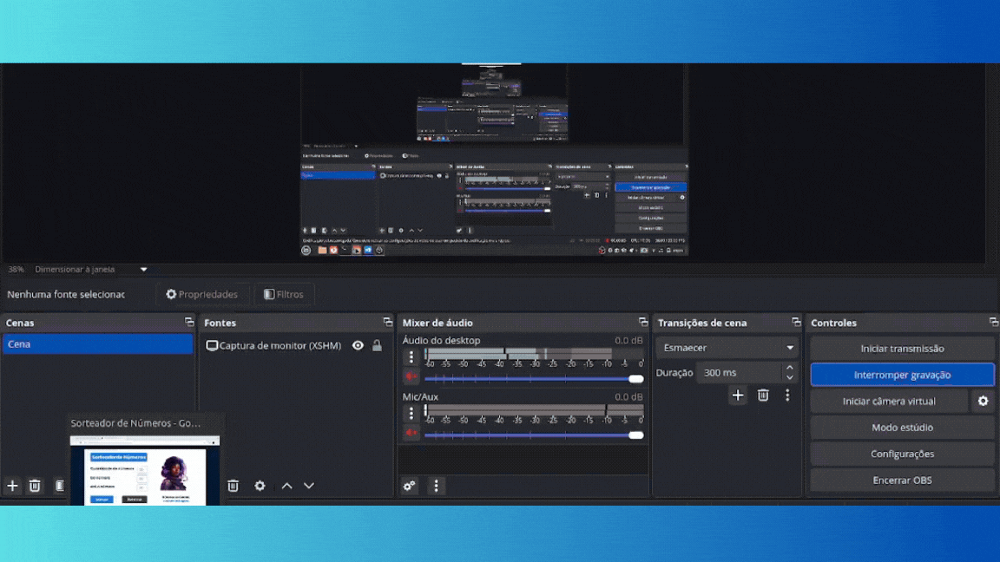
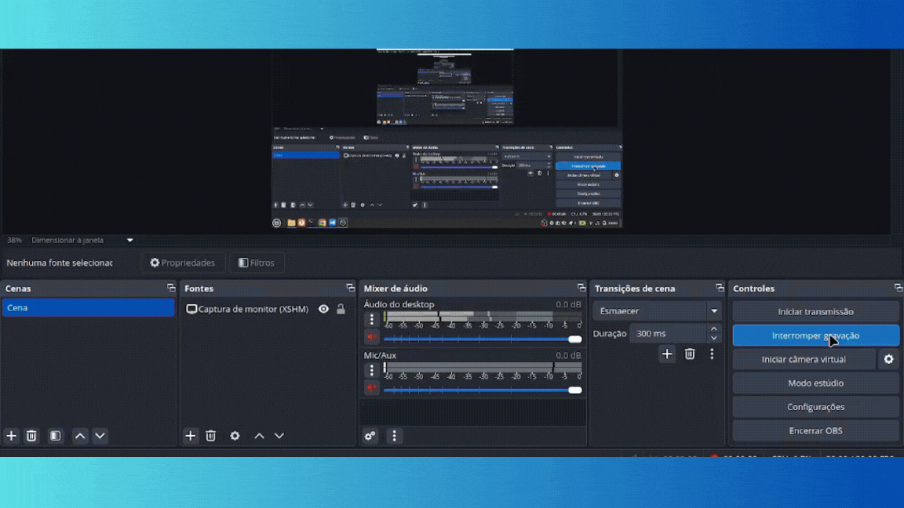
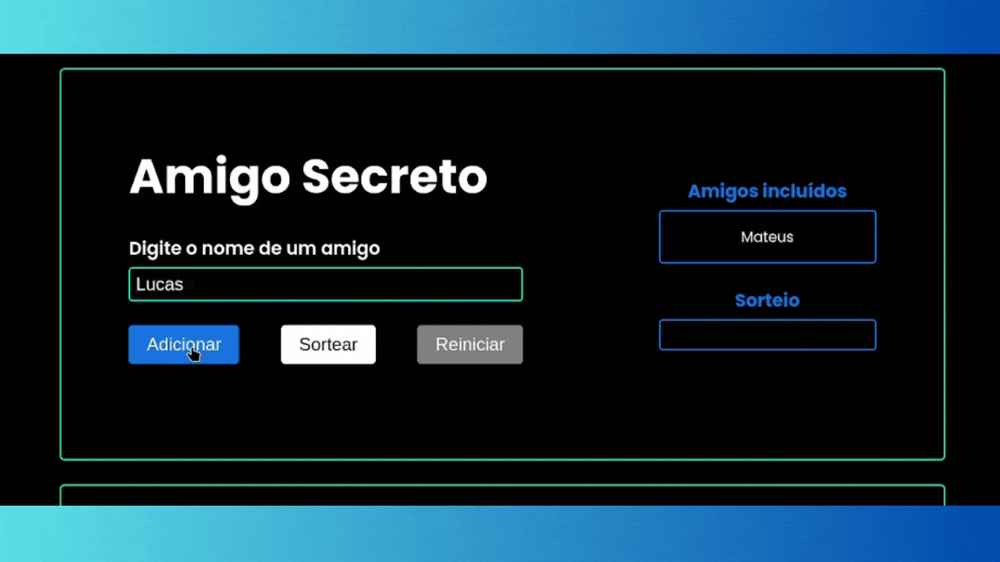

# 5. Lógica de programação: praticando com desafios

Apresentação dos projetos desenvolvidos pela Alura, mas existe um ponto muito importante, toda lógica contida nesses códigos foram desenvolvidas por minha pessoa, o caminho foi ensinada pela Escola de Programação, mas fiz algumas modificações, como a estilização e estrutura que foram criadas por mim, ou seja, eu apenas peguei a referência da Alura e fiz do zero. Lembrando que esses projetos não possuem o objetivo de trabalhar responsividade, mas lógica de programação, além do que foi ensinado no curso, fiz o adicionamento de algumas coisas.

## 1 - Sorteador de Números (app-sorteador-numeros)

Sorteador de Números é uma aplicação onde o usuário digita a quantidade de números que deseja percorrer entre dois percursos, caso ele escolha 2 como quantidade, ele deve decidir percorrer entre x e y (sabendo que x é 2 e y é 10) vai percorrer entre 2 e 10, e o programa vai retornar algo que seja igual/maior que 2, ou algo que seja igual/menor que 10. 

[Repositório](https://github.com/mateusmaciel460/cursos-alura/tree/main/app-challenge/app-sorteador-numeros) | 
[Deploy](https://zippy-sunflower-0a9bb3.netlify.app/)

## 2 - Aluguel de Jogos (app-alugames)

Aluguel de Jogos é uma aplicação onde o usuário pode alugar ou devolver jogos, caso ele deseje alugar/devolver terá um bom acesso visual, quando o usuário estive alugando, automaticamente a imagem do jogo ficará com uma opacidade, e quando estiver devolvedo, essa opacidade não existirá. Além da mudança de cores de botões, e um alerta, perguntando se de fato ele deseja confirmar a devolução. Um adendo importante: tem um contador de jogos alugados, totalmente interativo com a mudança (alugado para devolvido).

[Repositório](https://github.com/mateusmaciel460/cursos-alura/tree/main/app-challenge/app-alugames) | 
[Deploy](https://stalwart-axolotl-8b9a8a.netlify.app/)

## 3 - Carrinho de compras (app-carrinho-compras)

Carrinho de compras é uma aplicação onde você seleciona um produto, valor e sua quantidade. O programa vai calcular a quantidade daquele produto (1400 x 2 = 2800), e não existe apenas um produto (logicamente), com isso, você adicionará muitos itens e suas quantidades, no final será apresentado o total calculado dos itens adicionados.

[Repositório](https://github.com/mateusmaciel460/cursos-alura/tree/main/app-challenge/app-carrinho-compras) | 
[Deploy](https://genuine-kitsune-6b8820.netlify.app/)

## 4 - Ingresso Online (app-ingresso-online)

Ingresso Online é uma aplicação que verifica a quantidade de ingressos disponíveis para uma certa parte de uma galeria/cinema, e se caso tiver espaço disponível, ele vai liberar a quantidade, ou seja, diminuirá a mesma (100 - 20 = 80) - você deseja 20 cadeiras, e temos 100, logo será aprovada a requisição, e o próximo cliente terá acesso apenas a 80 e não 100, como foi com você.

[Repositório](https://github.com/mateusmaciel460/cursos-alura/tree/main/app-challenge/app-ingresso-online) | 
[Deploy](https://startling-granita-7bb33a.netlify.app/)

## 5 - Amigo Secreto (app-amigo-secreto)

Amigo Secreto é uma aplicação onde é possível adicionar 4 ou mais amigos para sortear quem vai presentear quem, além dessa simples funcionalidade, ele não permite que um campo vazio seja enviado, verificando se aquele mesmo nome já foi adicionado (Caso ele tenha adicionado Mateus iniciando com letra maiúscula, ele não vai permitir um [mateus] com letra minúscula, existe apenas um tipo de Mateus). Adendo: Ele edita e apagar os usuários adicionados.

[Repositório](https://github.com/mateusmaciel460/cursos-alura/tree/main/app-challenge/app-amigo-secreto) | 
[Deploy](https://superlative-pegasus-f42859.netlify.app/)

## 

Atenciosamente, @mateusmaciel460 :)